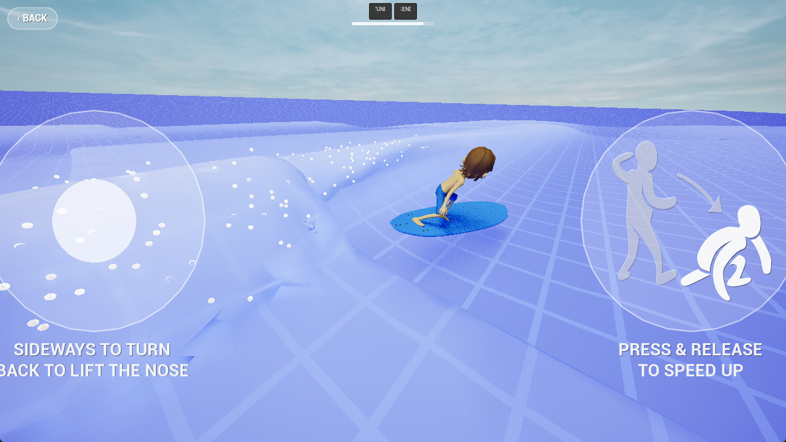
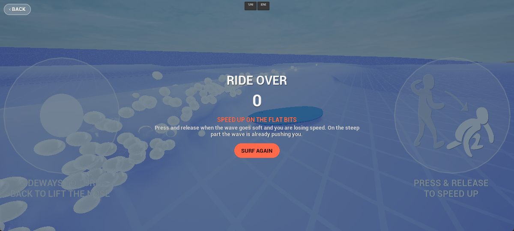

# Gone Surfing

A surfing physics sandbox for Android. There is no track to follow and no combo meter to feed —
there is a wave, a board, and whatever the two of them do together.

Built solo, in Unreal Engine 5.4, on a fork of the engine. Eight years of work: roughly 45 000 lines
of C++ and 110 specs.

> **This is a snapshot of the source, not a working copy of the project.** It holds the C++ module,
> the specs and the tooling — the parts worth reading. The engine fork, the art and the wave data
> are deliberately absent, so it will not build. [Why, in detail.](#what-is-not-here-and-why)

---

## The problem: a real wave on a phone

Surfing games fake the wave. The wave is an animation on a loop, and the board is a vehicle driving
along a spline. That is the only way to get a wave onto a phone — actually simulating breaking
water is a compute budget no handset has, by orders of magnitude.

So the wave here is not simulated at runtime. It is simulated **offline** — a FLIP fluid solve in
Blender (a separate, private repo) — and baked into data
tables: surface height, surface normal, water velocity, foam position, sampled on a grid at 24 Hz.
The phone replays that field and tiles it infinitely as the board travels.

What stays live is the **board**. Roughly twenty surface samplers — bottom panels, rails, fins,
nose, tail — each read the water under themselves every tick and push their own hydrodynamic
impulse into the rigid body. Nothing is scripted. The board planes because the bottom foil produces
upthrust at speed; it carves because the rails bite; it loses the wave if you sit behind the crest,
because there is no propulsion back there to have.

That split — offline water, live board — is what makes the thing run at 60 FPS on a mid-range
Android phone while the wave still behaves like water.

## Three tools, three jobs

The hardest lesson in the project, and the one that shaped the engine fork.

Physics like this is usually written entirely in forces, and it goes wrong in a specific way: a
force used to *resist* something overshoots and reverses. Measured here — a drag term whose only
job was to resist crossing the wave face went from −2 177 (resisting) to +12 507 (actively
driving) once the board was fast enough. A force-level governor on the summed drive moved the net
force by 12 %, because the ungoverned forces simply grew to compensate.

So the motion is produced by three separate tools, and they are not allowed to do each other's job:

| job | tool | where |
|---|---|---|
| add energy | **force** (impulse) | this project — per-surface, ~20 samplers per board |
| remove energy | **damping** toward a target velocity | the engine fork's Chaos solver |
| change direction without changing speed | **velocity redirect** | the engine fork's Chaos solver |

Damping asymptotes instead of overshooting. A redirect conserves speed instead of bleeding it.
[The engine fork](docs/engine-fork.md) exists to provide the second and third:
per-axis local linear and angular damping, per-axis velocity ceilings, and a set of velocity
redirects — rocker lift toward the wave's up-slope, carve grip toward the commanded heading,
wave-carry along the peel.

## Reproducible physics

Physics you cannot reproduce is physics you cannot change. Three things make a ride repeatable:

- **Trace replay.** Every ride records its input stream. Replaying it under `-usefixedtimestep`
  is tick-exact, so the same trace produces the same ride.
- **Scheduled overrides.** `-ReplayOverridesAt=<t> -ReplayOverrides=name=value` flips a coefficient
  in memory on exactly one tick, mid-replay. An A/B pair then rides *identical* physics up to the
  event under test — which is the only way to attribute a difference to the change rather than to
  divergence.
- **Snapshot tests.** An autopilot state machine drives scripted manoeuvres headlessly and records
  position/velocity/attitude to CSV; a compare step diffs against an approved baseline and grades
  drift in cm and deg.

## Built with an agent, deliberately

Since one year ago, everything is written with Claude Code. And spec driven since then. The interesting part is not that an agent wrote
the code — it is the loop built around it so the agent could be trusted with physics.

**Spec first.** Non-trivial work starts as a spec in [`GoneSurfing/specs/`](GoneSurfing/specs/) —
requirements, acceptance criteria, and an explicit list of the project's own principles the design
was checked against. 110 of them. They are the durable artifact; the code is downstream.

**A closed build/run/measure loop.** `RunGameAndCollectLogs.bat` kills the editor, builds, launches
the game headless with an autopilot, waits for it to quit, and diffs the resulting trajectory
against baselines. Editor hooks kill and relaunch around builds, because UE Live Coding locks UBT
while the editor is open. The agent can therefore finish a change *and verify it* without a human
in the loop.

**Telemetry as structured data, not log grep.** Three MCP servers in
[`GoneSurfing/Tools/mcp/`](GoneSurfing/Tools/mcp/):

- `surf-telemetry` — queries ride trajectory CSVs (`window`, `compare`, `find_events`) instead of
  parsing them by hand, and reports run staleness, which stops a months-old CSV being read as a
  regression.
- `surf-tuning` — resolves any of ~200 coefficients through a four-layer stack (compiled default →
  board profile → session override → per-board file), and searches them *by the reasoning in their
  header comments*.
- `surf-live` — reads and writes coefficients in a **running** game over Unreal's RemoteControl
  HTTP API, effective on the next physics tick. Tuning mid-ride, no relaunch.

That last one matters more than it sounds: the owner's rule is that A/B comparisons happen
*mid-ride*, never across two runs, because two runs diverge into two different rides and the
comparison becomes meaningless.

## Repo layout

| path | what |
|---|---|
| `GoneSurfing/Source/GoneSurfing/` | the single C++ module — board hydrodynamics, wave sampling, UI, scoring |
| `GoneSurfing/specs/` | 110 specs; start with `specs/README.md` |
| `GoneSurfing/Content/Boards/` | the five board profiles — the roster is data, not code |
| `GoneSurfing/Tools/mcp/` | the three MCP telemetry/tuning servers |
| `GoneSurfing/Tests/` | the snapshot-test compare/approve tooling |
| `CLAUDE.md` | the agent's working brief for this repo — the architecture in one page |

If you are here to read rather than to build, [`CLAUDE.md`](CLAUDE.md) is the densest single page,
and `specs/wave-interaction-damping-and-redirect.md` is the design decision the rest hangs off.

## What is not here, and why

Three things are missing, and each is missing for its own reason.

- **The engine fork.** Unreal Engine source may only be shared between Epic licensees, so it cannot
  be published. What it changes, and why it had to exist at all, is
  [written up in full](docs/engine-fork.md) — four files, about twenty commits, and the most
  interesting design decision in the project.
- **The art.** The rider is a commercially licensed character; the licence covers shipping it in a
  game, not redistributing it as a file.
- **The wave data.** Several gigabytes of baked fluid-simulation tables. They are the game's input,
  not its source, and they would make this repository unreadable to clone.

Without those, the project does not build. That is a deliberate trade: this repository exists to be
read, and the parts worth reading are all here.

## Licence and third-party content

The source in this repository is **© Emil Stenberg, all rights reserved.** It is published to be
read, not reused — there is no licence granting redistribution or derivative works. See
[`LICENSE`](LICENSE).

Third-party content shipped with the game is credited in
[`GoneSurfing/Content/Legal/ThirdPartyNotices.txt`](GoneSurfing/Content/Legal/ThirdPartyNotices.txt),
and under **About → Third-party licences** in the game itself. "Evening" is by Kevin MacLeod
(incompetech.com), CC BY 4.0.

---

Emil Stenberg — esandin@gmail.com
